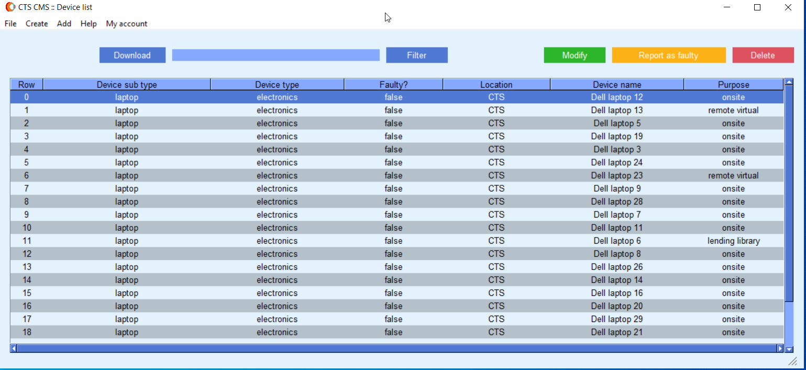

**CTS CMS**

---

Welcome to CTS CMS – Your Ultimate Resource Management Solution!

Are you looking for a robust, efficient, and user-friendly resource management software? Look no further! Our software is designed to streamline resource management for educational institutions, making the process smoother for administrators and students alike.

**Key Features:**

**Desktop Application for Admin and Staff:**

- **Resource Management**: With our desktop application, administrators and staff can easily add, edit, and delete resources. This means that you have full control over your resource inventory, ensuring that it's always up-to-date and accurate.

- **Maintenance Reporting**: Our software goes a step further by allowing users to report out-of-order products, ensuring timely maintenance. This proactive approach helps keep your resources in top condition, reducing downtime and increasing efficiency.

- **Online Database**: All data entered through the desktop application is securely stored in an online database. This enables instant access to information, from anywhere, at any time. No more sifting through paperwork or dealing with outdated spreadsheets!

**Mobile Application for Students:**

- **User-Friendly Design**: Our mobile app is designed with students in mind, ensuring a simple and intuitive user experience. Navigating through the app is a breeze, making it easy for students to manage resources effectively.

- **Barcode Scanning**: To hire or return a product, students can use the mobile app to scan the product's barcode. This hassle-free process ensures that students can quickly access the resources they need and return them with ease.

CTS CMS is the ultimate solution for educational institutions that want to enhance resource management. Say goodbye to the complexities of manual tracking and inefficient inventory management.

With our software, you'll enjoy the benefits of real-time updates, proactive maintenance, and a seamless experience for both administrators and students. Get ready to elevate your resource management to a whole new level.

Ready to get started? Explore the full potential of our software today and experience resource management made simple.
